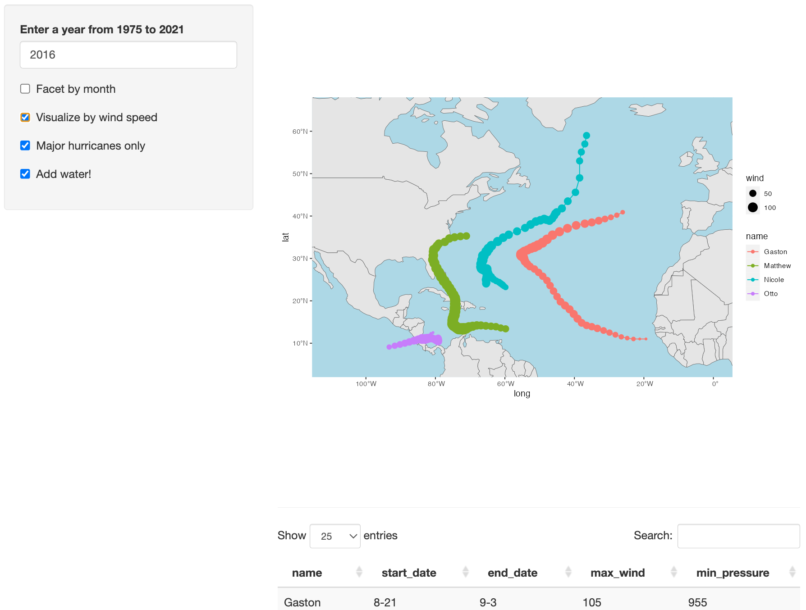

# Storms in the North Atlantic Shiny App





This repository contains a shiny app to visualize the trajectories of 
tropical cyclones (hurricanes) in the North Atlantic. The user can type in a given year, 
then select from four boxes to make additional changes. The first box facets the data into 
separate maps for each month. The second box takes into account the wind speeds and thickens 
the points. The third box only displays hurricanes that were considered major hurricanes, 
and the final box turns the background blue. 


## Storms Data Set

The data set behind this app is the `storms` data from the R package "dplyr".


## Running the app


To run the app in Rstudio, execute the following code in R:


```r
library(shiny)

# Run an app from a subdirectory in the repo

runGitHub(
  repo = "hurricanes-app",
  username = "jazmmiine")
  
```

## Author 

Jazmine Gamboa 

[jazmine-gamboa.quarto.pub](https://jazmine-gamboa.quarto.pub)